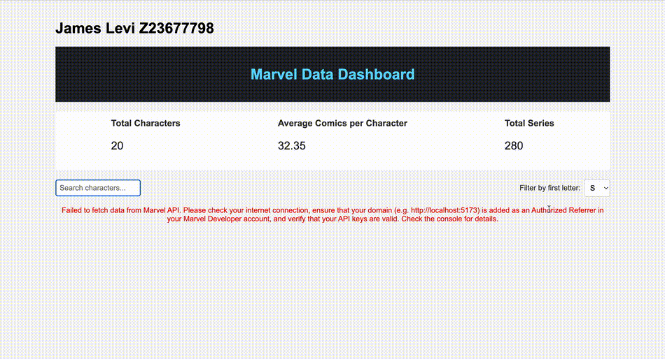

Below is an example README using the Marvel API for your data dashboard project:

---

# Web Development Project 5 - Marvel Data Dashboard

Submitted by: **James Levi**

This web app: The Marvel Data Dashboard is a responsive, interactive application that fetches and displays data from the Marvel API. It showcases Marvel characters, comics, and related details while providing summary statistics, search functionality, and multiple filters to help users explore the Marvel universe.

Time spent: **15 hours spent in total**

## Required Features

The following **required** functionality is completed:

- [x] **The list displays a list of data fetched using an API call**  
  The application fetches data from the Marvel API using asynchronous calls and displays characters, comics, and series in a user-friendly list view.
  
- [x] **Data uses the useEffect React hook and async/await syntax**  
  The Marvel API data is loaded on component mount using React's useEffect hook in combination with async/await for smooth data handling.
  
- [x] **The app dashboard includes at least three summary statistics about the data such as**  
  - Total number of Marvel characters displayed  
  - Total number of comics available in the dataset  
  - Average number of appearances per character (or an equivalent statistic based on available API data)
  
- [x] **A search bar allows the user to search for an item in the fetched data**  
  Users can search for specific Marvel characters or comics by entering keywords into the search bar.
  
- [x] **Multiple different filters (2+) allow the user to filter items in the database by specified categories**  
  The dashboard provides filters for categories such as character name, comic series, and publication year.

The following **optional** features are implemented:

- [x] Multiple filters can be applied simultaneously  
  Users can combine different filters (e.g., search by name and filter by publication year) to refine their results.
  
- [x] Filters use different input types such as a text input, a selection dropdown, and a slider  
  The app uses a text input for character names, a dropdown for comic series, and a slider to set a range for publication years.
  
- [x] The user can enter specific bounds for filter values  
  The slider allows users to choose custom minimum and maximum publication years.

The following **additional** features are implemented:

- [x] Responsive design for optimal viewing on mobile and desktop devices  
- [x] A detailed view for each character or comic including images and descriptions  
- [x] Loading spinners and error handling for a smooth user experience during data fetching

## Video Walkthrough

Here's a walkthrough of the implemented user stories:

 

Here is another clip showing the filter functionality
 

<!-- Replace the above link with your actual GIF URL. -->
GIF created with Kap

## Notes

During development, challenges included handling asynchronous data fetching from the Marvel API and managing state for multiple filters. Additionally, implementing responsive design and overcoming API rate limits required careful debugging and iterative testing.

## License

    Copyright [2025] [James Levi]
    
    Licensed under the Apache License, Version 2.0 (the "License");
    you may not use this file except in compliance with the License.
    You may obtain a copy of the License at
    
        http://www.apache.org/licenses/LICENSE-2.0
    
    Unless required by applicable law or agreed to in writing, software
    distributed under the License is distributed on an "AS IS" BASIS,
    WITHOUT WARRANTIES OR CONDITIONS OF ANY KIND, either express or implied.
    See the License for the specific language governing permissions and
    limitations under the License.

---

